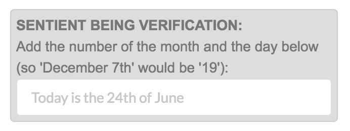

# sharpstone_captcha



This is a very simple ("programming with sharp stones") plugin to do CAPTCHA verification without a ton of JavaScripts or complexity. This also means you won't need to include some other provider's JavaScript (which you have no control over) or API (which can go down sometimes). If you need something quick - especially for a prototype site - and don't want to get bogged down with something complex, this should help. That said, it's probably solid enough for most consumer grade deployments.

Basically it presents the user with a question of adding the number of the month and the day in a field, and if the total is correct, then the test passes and you can process the rest of the form. The date is presented as "Today is the 12th of February" so someone would need to parse that back to integers if they wanted to try to bypass this. Which probably isn't worth anyone's time.

The equation being generated is encrypted into a param which gets passed back to the Gem as well. So if someone tries to crack into that it will blow up the result and also fail.

## Usage

Inserting this into a view is pretty easy. There's one call to get the params to put in the form. Then just copy and paste.

_Note that you can pass an optional crypt key if you don't want to use the default._

```
# In your view:

<% ssc_data = SharpstoneCaptcha.data_for_form %>
<%= hidden_field_tag :ssc_captcha_id, ssc_data[:ssc_captcha_id] %>
<%= text_field_tag :ssc_captcha_answer, "", :placeholder => ssc_data[:ssc_captcha_string] %>
```

I usually just put those 3 lines in a partial with whatever CSS classes I'm using.

```
# In your controller:

if !SharpstoneCaptcha.verify_data_captcha(params)
    flash[:error] = "Sentient Being Test Failed!"
else
    # Do something useful ...
end
```

Maybe in a later version I'll put in a helper for the Views. But for now I wanted it as basic as possible so that anyone using this can fold in their CSS without having to work around the Gem.

## Roadmap

The whole point of this thing is to be simple. Quickly get a reliable CAPTCHA onto a page in a way that won't require a lot of coding to accomodate it. That said, I can see adding other "formulas" ... like the classic "add/multiply these numbers" where the nunmbers are written out as text. Pretty much any expression that can be eval()'d could be used since the "answer" is encrypted in the form body.

## TODO:

- [x] Tests
- [ ] I18N Support 
- [ ] Math expressions as an optional verification input
- [ ] "Which box is red/green/blue" as an optional verification input
